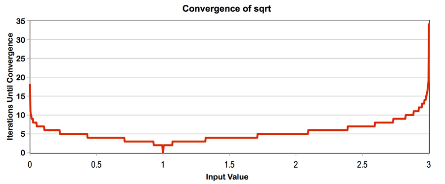
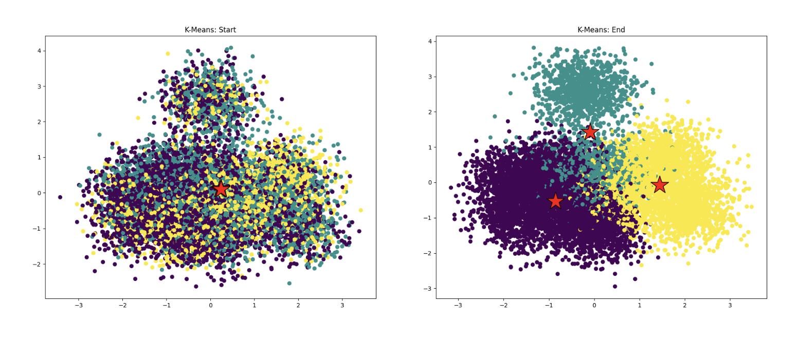

# 作业1：四核CPU性能分析 #

**截止日期：10月7日星期一，晚上11:59**

**总分：100分 + 6分额外加分**

## 概述 ##

本作业旨在帮助你理解现代多核CPU中存在的两种主要并行执行形式：

1. 单个处理核心内的SIMD执行
2. 使用多核的并行执行（你还将看到Intel超线程的效果）

你还将获得测量和分析并行程序性能的经验（这是一项具有挑战性但非常重要的技能，你将在本课程中多次使用）。本作业涉及少量编程，但需要大量的分析！

## 环境设置 ##

__你需要在新的myth机器上运行代码来完成此作业__（这些机器的主机名是`myth[51-66].stanford.edu`）。如果由于某种原因你在myth机器上没有主目录，请在此处提交HelpSU工单[here](https://stanford.service-now.com/it_services?id=sc_cat_item&sys_id=cab169801bd918d0685d4377cc4bcbe0)。

这些机器配备了四核4.2 GHz Intel Core i7处理器（尽管动态频率缩放可以在芯片认为有用且可能的情况下将其提升至4.5 GHz）。处理器中的每个核心支持两个硬件线程（Intel称之为“超线程”），并且这些核心可以执行AVX2向量指令，这些指令描述了在多个单精度数据值上同时执行相同的八宽操作。对于好奇的同学，可以在<https://ark.intel.com/products/97129/Intel-Core-i7-7700K-Processor-8M-Cache-up-to-4-50-GHz->找到该CPU的完整规格。想要深入了解的同学可能会喜欢[这篇文章](https://en.wikichip.org/wiki/intel/microarchitectures/kaby_lake)。

注意：为了评分目的，我们希望你报告在斯坦福myth机器上运行的代码的性能，但为了好玩，你也可以在自己的机器上运行本作业中的程序。（你需要首先安装Intel SPMD程序编译器（ISPC），可在此处获取：<http://ispc.github.io/>）。欢迎在报告中包含在其他机器上运行代码的发现，只需明确说明你在哪台机器上运行。

开始步骤：

1. 需要ISPC来编译本作业中使用的许多程序。可以通过以下步骤在myth机器上轻松安装ISPC：  

从myth机器上下载Linux二进制文件到你选择的本地目录。你可以从ISPC[下载页面](https://ispc.github.io/downloads.html)获取Linux的ISPC编译器二进制文件。在`myth`上，我们建议你使用`wget`直接从下载页面下载二进制文件。截至2024年秋季第1周，以下`wget`命令有效：

    wget https://github.com/ispc/ispc/releases/download/v1.24.0/ispc-v1.24.0-linux.tar.gz

解压下载的文件：`tar -xvf ispc-v1.24.0-linux.tar.gz`

将ISPC的`bin`目录添加到系统路径中。例如，如果解压下载的文件后生成目录`~/Downloads/ispc-v1.24.0-linux`，在bash中你可以使用以下命令更新路径变量：

    export PATH=$PATH:${HOME}/Downloads/ispc-v1.24.0-linux/bin

可以将上述行添加到`.bashrc`文件中以永久生效。

如果你使用的是csh，你将使用`setenv`更新`PATH`。快速谷歌搜索将教你如何操作。

2. 作业起始代码可在<https://github.com/stanford-cs149/asst1>获取。请使用以下命令克隆作业1的起始代码：

    `git clone https://github.com/stanford-cs149/asst1.git`

## 程序1：使用线程并行生成分形图（20分） ##

构建并运行代码库中`prog1_mandelbrot_threads/`目录下的代码。（输入`make`进行构建，输入`./mandelbrot`运行。）该程序生成图像文件`mandelbrot-serial.ppm`，这是著名的复数集合Mandelbrot集的可视化。大多数平台都有.ppm查看器。要远程查看生成的图像，首先确保你有_X server_。Linux系统不需要下载。然而，Mac用户可以使用[Xquartz](https://www.xquartz.org/)，Windows用户可以使用[VcXsrv](https://sourceforge.net/projects/vcxsrv/)。在确保SSH X-Forwarding支持后，确保你使用`ssh -Y`登录到myth机器，然后可以使用`display`命令查看图像。正如你在下面的图像中看到的，结果是一个熟悉而美丽的分形图。图像中的每个像素对应于复平面中的一个值，每个像素的亮度与确定该值是否包含在Mandelbrot集中的计算成本成正比。要获取图像2，请使用命令选项`--view 2`。（参见`mandelbrotSerial.cpp`中定义的`mandelbrotSerial()`函数）。你可以在<http://en.wikipedia.org/wiki/Mandelbrot_set>了解更多关于Mandelbrot集的定义。

你的任务是使用[std::thread](https://en.cppreference.com/w/cpp/thread/thread)并行化图像的计算。起始代码在`mandelbrotThread.cpp`中的`mandelbrotThread()`函数中提供了一个生成一个额外线程的示例。在此函数中，主应用程序线程使用构造函数`std::thread(function, args...)`创建另一个线程，并通过调用线程对象上的`join`等待该线程完成。目前启动的线程不执行任何计算并立即返回。你应该在`workerThreadStart`函数中添加代码来完成此任务。在本作业中，你不需要使用任何其他std::thread API调用。

**你需要做的是：**

1. 修改起始代码以使用两个处理器并行化Mandelbrot生成。具体来说，在线程0中计算图像的上半部分，在线程1中计算图像的下半部分。这种类型的问题分解被称为_空间分解_，因为图像的不同空间区域由不同的处理器计算。
2. 扩展你的代码以使用2、3、4、5、6、7和8个线程，相应地分配图像生成工作（线程应获取图像的块）。请注意，处理器只有四个核心，但每个核心支持两个超线程，因此它可以在其执行内容上交错执行总共八个线程。在你的报告中，生成一个图表，显示__与参考顺序实现相比的加速比__作为使用线程数量的函数__对于视图1__。加速比是否与使用的线程数量线性相关？在你的报告中假设为什么是（或不是）这种情况？（你可能还希望为视图2生成一个图表以帮助你得出一个好的答案。提示：仔细查看三线程数据点。）
3. 为了确认（或反驳）你的假设，通过在`workerThreadStart()`的开头和结尾插入计时代码来测量每个线程完成其工作所需的时间。你的测量结果如何解释你之前创建的加速比图表？
4. 修改工作到线程的映射，以在Mandelbrot集的两个视图上实现至少__7-8倍的加速比__（如果你超过7倍，那也没关系，不用担心）。在你的解决方案中，你不能使用任何线程间的同步。我们希望你提出一个适用于所有线程数量的单一工作分解策略——不允许为每个配置硬编码特定解决方案！（提示：有一个非常简单的静态分配可以实现这一目标，并且不需要线程间的通信/同步。）在你的报告中，描述你的并行化方法并报告最终获得的8线程加速比。
5. 现在用16个线程运行你改进后的代码。性能是否明显高于使用8个线程时？为什么或为什么不？

## 程序2：使用SIMD内部函数向量化代码（20分） ##

查看作业1代码库中`prog2_vecintrin/main.cpp`中的函数`clampedExpSerial`。`clampedExp()`函数将`values[i]`提升到`exponents[i]`给出的幂，并将结果值限制在9.999999。在程序2中，你的任务是向量化这段代码，以便它可以在具有SIMD向量指令的机器上运行。

然而，与其使用映射到现代CPU上真实SIMD向量指令的SSE或AVX2向量内部函数来构建实现，为了简化，我们要求你使用CS149的“伪向量内部函数”来实现你的版本，这些函数定义在`CS149intrin.h`中。`CS149intrin.h`库为你提供了一组操作向量值和/或向量掩码的向量指令。（这些函数不会转换为真实的CPU向量指令，相反，我们在库中为你模拟这些操作，并提供反馈以便于调试。）作为使用CS149内部函数的示例，`main.cpp`中给出了`abs()`函数的向量化版本。此示例包含一些基本的向量加载和存储操作，并操作掩码寄存器。请注意，`abs()`示例只是一个简单的示例，实际上代码并不能正确处理所有输入！（我们将让你找出原因！）你可能希望阅读`CS149intrin.h`中的所有注释和函数定义，以了解你可以使用的操作。

以下是一些提示，帮助你完成实现：

-  每个向量指令都有一个可选的掩码参数。掩码参数定义了哪些通道的输出被“掩码”了。掩码中的0表示该通道被掩码，因此其值不会被向量操作的结果覆盖。如果操作中未指定掩码，则没有通道被掩码。（注意，这相当于提供一个全1的掩码。）
   *提示：*你的解决方案需要使用多个掩码寄存器和库中提供的各种掩码操作。
-  *提示：*在此问题中，`_cs149_cntbits`函数可能很有用。
-  考虑如果循环迭代的总次数不是SIMD向量宽度的倍数会发生什么。我们建议你使用`./myexp -s 3`测试你的代码。*提示：*你可能会发现`_cs149_init_ones`很有用。
-  *提示：*使用`./myexp -l`在最后打印执行的向量指令日志。使用函数`addUserLog()`在日志中添加自定义调试信息。随意添加额外的`CS149Logger.printLog()`以帮助你调试。

程序的输出将告诉你你的实现是否生成正确的输出。如果有不正确的结果，程序将打印它找到的第一个错误，并打印出函数输入和输出的表格。你的函数的输出在“output = ”之后，应与“gold = ”之后的结果匹配。程序还打印出一组描述CS149伪向量单元利用率的统计信息。你应该将实现的性能视为“Total Vector Instructions”的值。（你可以假设每个CS149伪向量指令在CS149伪SIMD CPU上需要一个周期。）“Vector Utilization”显示启用的向量通道的百分比。

**你需要做的是：**

1. 在`clampedExpVector`中实现`clampedExpSerial`的向量化版本。你的实现应适用于任何输入数组大小（`N`）和向量宽度（`VECTOR_WIDTH`）的组合。
2. 运行`./myexp -s 10000`并将向量宽度从2、4、8扫到16。记录生成的向量利用率。你可以通过更改`CS149intrin.h`中的`#define VECTOR_WIDTH`值来实现。随着`VECTOR_WIDTH`的变化，向量利用率是增加、减少还是保持不变？为什么？
3.  _额外加分：（1分）_在`arraySumVector`中实现`arraySumSerial`的向量化版本。你的实现可以假设`VECTOR_WIDTH`是输入数组大小`N`的因子。虽然串行实现的运行时间为`O(N)`，但你的实现应争取运行时间为`(N / VECTOR_WIDTH + VECTOR_WIDTH)`，甚至`(N / VECTOR_WIDTH + log2(VECTOR_WIDTH))`。你可能会发现`hadd`和`interleave`操作很有用。

## 程序3：使用ISPC并行生成分形图（20分） ##

现在你已经熟悉了SIMD执行，我们将回到并行Mandelbrot分形生成（如程序1）。与程序1类似，程序3计算Mandelbrot分形图像，但它通过利用CPU的四个核心和每个核心内的SIMD执行单元实现了更大的加速。

在程序1中，你通过为系统中的每个处理核心创建一个线程来并行化图像生成。然后，你将部分计算分配给这些并发执行的线程。（由于程序1中的线程与处理核心是一对一的，你有效地将工作显式分配给核心。）程序3没有指定计算到并发执行线程的特定映射，而是使用ISPC语言结构来描述*独立计算*。这些计算可以在不违反程序正确性的情况下并行执行（并且它们确实会！）。在Mandelbrot图像的情况下，计算每个像素的值是一个独立计算。有了这些信息，ISPC编译器和运行时系统负责生成一个尽可能高效地利用CPU的并行执行资源集合的程序。

你将修复程序3中的一个简单错误，该程序是用C++和ISPC编写的（该错误导致性能问题，而不是正确性问题）。通过正确的修复，你应该观察到性能比原始顺序Mandelbrot实现`mandelbrotSerial()`高出32倍以上。
### 程序 3，第一部分：ISPC 基础入门（20 分中的 10 分） ###

阅读 ISPC 代码时，你必须牢记，尽管代码看起来很像 C/C++ 代码，但 ISPC 的执行模型与标准的 C/C++ 不同。与 C 语言相比，ISPC 程序的多个程序实例总是在 CPU 的 SIMD 执行单元上并行执行。同时执行的程序实例数量由编译器决定（并会根据底层机器的具体情况进行选择）。这个并发实例的数量可以通过内置变量 `programCount` 供 ISPC 程序员使用。ISPC 代码可以通过内置的 `programIndex` 引用其自身的程序实例标识符。因此，从 C 代码调用 ISPC 函数可以被看作是创建了一组并发的 ISPC 程序实例（在 ISPC 文档中称为“组”）。这组实例运行完成后，控制权会返回到调用的 C 代码。

__停。我是你们亲切的讲师。请再读一遍前面的段落。相信我。__

例如，下面的程序结合了常规的 C 代码和 ISPC 代码来对两个包含 1024 个元素的向量进行相加操作。正如我们在课堂上讨论的，由于组中的每个实例都是独立的，并且执行的是完全相同的程序逻辑，因此可以通过使用 SIMD 指令来加速执行。

下面是一个简单的 ISPC 程序。以下 C 代码将调用下面的 ISPC 代码：

    ------------------------------------------------------------------------
    C 程序代码：myprogram.cpp
    ------------------------------------------------------------------------
    const int TOTAL_VALUES = 1024;
    float a[TOTAL_VALUES];
    float b[TOTAL_VALUES];
    float c[TOTAL_VALUES];

    // 在这里初始化数组 a 和 b。

    sum(TOTAL_VALUES, a, b, c);

    // 从 sum 函数返回后，a + b 的结果存储在 c 中。

对应的 ISPC 代码如下：

    ------------------------------------------------------------------------
    ISPC 代码：myprogram.ispc
    ------------------------------------------------------------------------
    export sum(uniform int N, uniform float* a, uniform float* b, uniform float* c)
    {
      // 假设 programCount 能整除 N。
      for (int i = 0; i < N; i += programCount)
      {
        c[programIndex + i] = a[programIndex + i] + b[programIndex + i];
      }
    }

上面的 ISPC 程序代码在各个程序实例之间交错处理数组元素。注意这与程序 1 的相似之处，在程序 1 中你将图像的不同部分静态分配给各个线程。

然而，与其考虑如何在程序实例之间分配工作（即如何将工作映射到执行单元），通常更方便、更强大的做法是只关注如何将问题分解为独立的部分。ISPC 的 `foreach` 结构提供了一种表达问题分解的机制。在下面的例子中，ISPC 函数 `sum2` 中的 `foreach` 循环定义了一个迭代空间，其中所有迭代都是独立的，因此可以按任意顺序执行。ISPC 负责将循环迭代分配给并发的程序实例。下面 `sum` 和 `sum2` 之间的区别很细微，但非常重要。`sum` 是命令式的：它描述了如何将工作映射到并发实例。下面的例子是声明式的：它只指定了要执行的工作集合。

    -------------------------------------------------------------------------
    ISPC 代码：
    -------------------------------------------------------------------------
    export sum2(uniform int N, uniform float* a, uniform float* b, uniform float* c)
    {
      foreach (i = 0 ... N)
      {
        c[i] = a[i] + b[i];
      }
    }

在继续之前，建议你通过阅读 <http://ispc.github.io/example.html> 上的 ISPC 教程来熟悉 ISPC 语言结构。教程中的示例程序与程序 3 中 `mandelbrot.ispc` 里的 `mandelbrot_ispc()` 实现几乎完全相同。在作业代码中，我们改变了 `foreach` 循环的边界，以得到更直接的实现。

**你需要做的事情：**

1. 编译并运行 `mandelbrot_ispc` 程序。__当前 ISPC 编译器配置为生成 8 路 AVX2 向量指令。__ 根据你对这些 CPU 的了解，你期望的最大加速比是多少？为什么你观察到的数值可能小于这个理想值？（提示：考虑你正在执行的计算的特点。描述图像中哪些部分对 SIMD 执行构成挑战。比较渲染不同视图的曼德勃罗集的性能可能有助于证实你的假设。）

  我们提醒你，对于本小节中描述的代码，ISPC 编译器将一组程序实例映射到在单个核心上执行的 SIMD 指令。这种并行化方案与程序 1 不同，在程序 1 中，加速比是通过在多个核心上运行线程来实现的。

如果你查看关于 myth 机器中 CPU 的详细技术资料，你会发现有一套复杂的规则规定了每个时钟周期可以运行多少条标量和向量指令。为了完成本作业，你可以假设浮点运算的 8 路向量执行单元的数量与标量执行单元的数量大致相同。

### 程序 3，第二部分：ISPC 任务（20 分中的 10 分） ###

ISPC 的 SPMD 执行模型和像 `foreach` 这样的机制有助于创建利用 SIMD 处理的程序。该语言还提供了一种额外的机制，可在 ISPC 计算中利用多个核心。这种机制就是启动 _ISPC 任务_。

查看 `mandelbrot_ispc_withtasks` 函数中的 `launch[2]` 命令。这个命令会启动两个任务。每个任务定义了一个将由一组 ISPC 程序实例执行的计算。正如 `mandelbrot_ispc_task` 函数所定义的，每个任务都会计算最终图像的一个区域。类似于 `foreach` 结构定义的循环迭代可以按任意顺序执行（并由 ISPC 程序实例并行执行），通过这个启动操作创建的任务可以按任意顺序处理（并在不同的 CPU 核心上并行处理）。

**你需要做的事情：**

1. 使用参数 `--tasks` 运行 `mandelbrot_ispc`。在视图 1 中你观察到的加速比是多少？与未将计算划分为任务的 `mandelbrot_ispc` 版本相比，加速比是多少？
2. 有一种简单的方法可以通过更改代码创建的任务数量来提高 `mandelbrot_ispc --tasks` 的性能。仅通过修改 `mandelbrot_ispc_withtasks()` 函数中的代码，你应该能够实现比顺序版本的代码快 32 倍以上的性能！你是如何确定要创建多少个任务的？为什么你选择的这个数量效果最好？
3.  _额外加分（2 分）：线程抽象（在程序 1 中使用）和 ISPC 任务抽象之间有什么区别？（创建/连接）和（启动/同步）机制在语义上有一些明显的区别，但这些区别的影响更为微妙。这里有一个思想实验来引导你的回答：当你启动 10000 个 ISPC 任务时会发生什么？当你启动 10000 个线程时会发生什么？（对于这个思想实验，请从一般情况进行讨论，即不要将你的讨论局限于给定的曼德勃罗集程序。）

_聪明学生的问题_：嘿，等一下！为什么有两种不同的机制（`foreach` 和 `launch`）用于向 ISPC 系统表达独立的、可并行化的工作？系统难道不能将 `foreach` 的多次迭代分配到所有核心上，并为这些核心生成适当的 SIMD 代码吗？

_答案_：好问题！有很多可能的答案。来办公时间找我讨论吧。 
## 程序 4：迭代求平方根（15 分） ##

程序 4 是一个 ISPC 程序，用于计算 2000 万个介于 0 到 3 之间的随机数的平方根。它采用了一种快速的迭代平方根计算方法，使用牛顿法来求解方程 $\frac{1}{x^2} - S = 0$。在这个实现中，初始猜测值使用 1.0。下面的图表展示了在 (0 - 3) 范围内，`sqrt` 收敛到精确解所需的迭代次数。（该实现对于此范围之外的输入不会收敛）。请注意，收敛速度取决于初始猜测值的准确性。

注意：这个问题是一个复习，用于再次检查你是否理解相关知识，因为它涵盖了与程序 2 和程序 3 类似的概念。

**你需要做的事情：**

1. 编译并运行 `sqrt` 程序。报告单 CPU 核心（不使用任务）和使用所有核心（使用任务）时 ISPC 实现的加速比。SIMD 并行化带来的加速比是多少？多核并行化带来的加速比是多少？
2. 修改数组 `values` 的内容，以提高 ISPC 实现的相对加速比。构造一个特定的输入，使得 **相对于顺序版本的代码加速比最大**，并报告（使用任务和不使用任务的 ISPC 实现）最终实现的加速比。你的修改是否提高了 SIMD 加速比？是否提高了多核加速比（即从无任务的 ISPC 实现转变为有任务的 ISPC 实现所带来的好处）？请解释原因。
3. 为 `sqrt` 构造一个特定的输入，使得 **无任务的 ISPC 实现相对于顺序版本的代码加速比最小**。描述这个输入，说明你选择它的原因，并报告 ISPC 实现的相对性能。效率降低的原因是什么？ 
    **（请记住，我们使用 `--target=avx2` 选项来编译 ISPC，该选项会生成 8 路 SIMD 指令）**。 
4. **额外加分（最多 2 分）**：手动使用 AVX2 内联函数编写你自己版本的 `sqrt` 函数。要获得加分，你的实现应该与使用 ISPC 生成的二进制文件速度相近（或更快）。你会发现 [英特尔内联函数指南](https://software.intel.com/sites/landingpage/IntrinsicsGuide/) 非常有用。

## 程序 5：BLAS `saxpy`（10 分） ##

程序 5 实现了 BLAS（基本线性代数子程序）库中的 saxpy 例程，该例程在许多系统中被广泛使用且经过了大量优化。`saxpy` 执行简单的操作 `result = scale * X + Y`，其中 `X`、`Y` 和 `result` 是长度为 `N` 的向量（在程序 5 中，`N` = 2000 万），`scale` 是一个标量。请注意，`saxpy` 每使用三个元素就会执行两个数学运算（一次乘法和一次加法）。`saxpy` 是一个 **极易并行化的计算**，具有可预测的、规则的数据访问和可预测的执行成本。

**你需要做的事情：**

1. 编译并运行 `saxpy` 程序。该程序将报告无任务和有任务的 ISPC 实现的 saxpy 性能。使用有任务的 ISPC 实现时，你观察到的加速比是多少？解释该程序的性能表现。你认为它可以大幅改进吗？（例如，你能否重写代码以实现接近线性的加速比？是或否？请说明理由。）
2. **额外加分（1 分）**：注意，`main.cpp` 中计算所消耗的总内存带宽为 `TOTAL_BYTES = 4 * N * sizeof(float)`。尽管 `saxpy` 从 `X` 中加载一个元素，从 `Y` 中加载一个元素，并向 `result` 中写入一个元素，但乘以 4 是正确的。为什么会这样呢？（提示：想想 CPU 缓存是如何工作的。）
3. **额外加分（视情况而定）**：提高 `saxpy` 的性能。
  我们希望看到显著的加速比，而不仅仅是几个百分点的提升。如果成功了，请描述你是如何做到的，以及在这些系统上最佳实现可能达到的效果。如果成功了，也请告诉工作人员，我们会很感兴趣的。 ;-)

注意：过去有些学生在这个问题上想得过于复杂而陷入困境。我们期望一个简单的答案，但运行这个问题的结果可能会引发你更多的疑问。鼓励你与工作人员交流。

## 程序 6：加速 `K - 均值` 算法（15 分） ##

程序 6 使用 K - 均值数据聚类算法对 100 万个数据点进行聚类（[维基百科](https://en.wikipedia.org/wiki/K - means_clustering)，[CS 221 讲义](https://stanford.edu/~cpiech/cs221/handouts/kmeans.html)）。如果你不熟悉该算法，不用担心！算法的具体细节对本次练习并不重要，但从高层次来说，给定 K 个起始点（聚类中心），该算法会迭代更新这些中心，直到满足收敛条件。下面的图片展示了程序开始和结束时算法的状态，其中红色星星表示聚类中心，数据点的颜色对应其所属的聚类。

在初始代码中，你已经得到了一个正确的 K - 均值算法实现，但目前它的速度还没有达到我们期望的水平。这就是你要发挥作用的地方！你的任务是找出 **实现中需要改进的地方** 以及 **如何进行改进**。在这个问题中，你要练习的关键技能是 **找出性能瓶颈**。我们不会告诉你在代码中哪里可以找到问题，你需要自己去发现。你首先应该思考的是……代码中哪些部分花费的时间最多，你应该在源代码中插入计时代码来进行测量。根据这些测量结果，你应该聚焦于那些占用了大量运行时间的代码部分，然后更仔细地研究它们，以确定是否有办法加快速度。

**你需要做的事情：**

1. 使用命令 `ln -s /afs/ir.stanford.edu/class/cs149/data/data.dat ./data.dat` 在当前目录下创建一个指向数据集的符号链接（确保你处于 `prog6_kmeans` 目录中）。这是一个大文件（约 800MB），因此这是访问它的首选方式。不过，如果你想要一个本地副本，可以在个人机器上运行命令 `scp [你的 SUNetID]@myth[51 - 66].stanford.edu:/afs/ir.stanford.edu/class/cs149/data/data.dat ./data.dat`。获取数据后，编译并运行 `kmeans` 程序（第一次运行时，程序加载数据可能会比平时花费更长时间）。该程序将报告算法在该数据上的总运行时间。
2. 运行 `pip install -r requirements.txt` 下载必要的绘图包。接下来，尝试运行 `python3 plot.py`，它将根据运行 `kmeans` 生成的日志文件（`start.log` 和 `end.log`）生成 "start.png" 和 "end.png" 文件。这些文件将位于当前目录中，应该与上面的图片类似。 **警告：你可能会注意到并非所有点都被分配到了“最近”的聚类中心。这是正常的。** （想了解原因的人请注意：我们使用 [主成分分析（PCA）](https://en.wikipedia.org/wiki/Principal_component_analysis) 将 100 维的数据点投影到二维空间以进行可视化。因此，虽然在高维空间中 100 维的数据点靠近相应的聚类中心，但在二维空间中，数据点和聚类中心的投影可能并不接近。）只要聚类结果看起来 “合理”（以步骤 2 中初始代码生成的图片为参考），并且大多数点似乎都被分配到了最近的聚类中心，代码就是正确的。
3. 使用 `common/CycleTimer.h` 中的计时函数来确定代码中的性能瓶颈所在。你需要调用 `CycleTimer::currentSeconds()`，它将以浮点数形式返回当前时间（以秒为单位）。代码中大部分时间花在哪里了？
4. 根据上一步的发现，改进实现。我们希望看到大约 2.1 倍或更高的加速比（即 $\frac{旧运行时间}{新运行时间} \geq 2.1$）。请解释你是如何得到解决方案的，以及你的最终解决方案是什么和相应的加速比。对这个过程的书面描述应该包含一系列步骤。我们期望看到类似 “我测量了……这让我相信 X。所以为了改进，我尝试了……结果加速/减速了……” 这样的内容。

限制条件：
- 你只能修改 `kmeansThread.cpp` 中的代码。你不能修改 `stoppingConditionMet` 函数，也不能更改 `kMeansThread` 的接口，但其他方面都可以修改（例如，你可以向 `WorkerArgs` 结构体添加新成员、重写函数、分配新数组等）。不过……
- **确保你不会改变实现的功能！如果算法不收敛，或者运行 `python3 plot.py` 的结果与初始代码生成的结果不同，那就说明有问题！** 例如，你不能简单地删除主 “while” 循环或更改 `dist` 函数的语义，因为这会导致结果不正确。
- **重要提示：** 你只能对以下函数中的 **一个** 进行并行化：`dist`、`computeAssignments`、`computeCentroids`、`computeCost`。关于如何使用 `std::thread` 编写并行代码的示例，请参考 `prog1_mandelbrot_threads/mandelbrotThread.cpp`。

提示 / 注意事项： 
- 这个问题不需要大量的编码工作。我们的解决方案大约修改/添加了 20 - 25 行代码。
- 一旦你使用计时器找出了瓶颈，在改进代码时，要确保你理解 K、M 和 N 的相对大小。
- 尝试优先改进那些有较大潜在收益的代码，并思考问题中可用的不同并行方式，以及如何利用它们。
- **这个程序的目标是让你更多地练习如何对性能导向的程序进行性能分析和调试。即使你没有达到性能目标，但如果你在书面描述中展示了良好的/深思熟虑的调试技巧，仍然可以获得大部分分数。**

## ARM 架构的 Mac 电脑怎么办？ ##

对于有新款苹果 ARM 架构笔记本电脑的同学，尝试在程序 3、4 和 5 中将 ISPC 编译目标改为 `neon - i32x8`，编译架构改为 `aarch64`。其他程序只使用 GCC 编译，应该会生成正确的目标文件。提交一份关于新款苹果 ARM 架构笔记本电脑上各个程序性能的报告。工作人员对你的发现会很感兴趣。你从 SIMD 执行中观察到了怎样的加速比？没有新款 Macbook 的同学可以尝试使用像 AWS 这样的云服务提供商提供的 ARM 架构服务器，不过工作人员尚未对此进行测试。在提交作业之前，请确保将 ISPC 编译目标重置为 `avx2 - i32x8`，编译架构重置为 `x86 - 64`，因为我们将在 myth 机器上测试你的解决方案！

## 求知欲强的同学（强烈推荐） ##

想了解 ISPC 以及它是如何诞生的吗？ISPC 的两位创造者之一 Matt Pharr 写了一篇 **精彩的博客文章**，讲述了它的发展历程，文章名为 [The story of ispc](https://pharr.org/matt/blog/2018/04/30/ispc - all)。这篇文章真正触及了并行系统设计的许多问题 —— 特别是有限范围的语言与通用编程语言的价值对比。在我看来，这是 CS149 学生必读的文章！

## 提交说明 ##

作业将通过 [Gradescope](https://www.gradescope.com) 提交。每个小组只需提交一次。但是，请确保在 Gradescope 提交中添加你队友的姓名。在 Gradescope 上有两个地方需要提交文件：`作业 1（书面报告）` 和 `作业 1（代码）`。

请将以下内容放入 `作业 1（书面报告）`：
* 你的书面报告，文件名为 `writeup.pdf`。请确保文档中包含小组两名成员的姓名和 SUNet ID（如果是两人小组）。

请将以下内容放入 `作业 1（代码）`：
* 程序 2 中 `main.cpp` 的实现，文件名为 `prob2.cpp`
* 程序 6 中 `kmeansThread.cpp` 的实现，文件名为 `prob6.cpp`
* 任何额外的代码，例如你尝试了额外加分的内容

请告知助教在你的书面报告中查看额外加分的内容。提交的所有代码必须能够在 myth 机器上直接编译和运行！

## 资源和注意事项 ##

- 可以在 <http://ispc.github.io/> 找到丰富的 ISPC 文档和示例。
- 放大曼德勃罗集图像的不同位置会非常有趣。
- 英特尔在 <http://software.intel.com/en - us/avx/> 上提供了很多关于 AVX2 向量指令的支持材料。  
- [英特尔内联函数指南](https://software.intel.com/sites/landingpage/IntrinsicsGuide/) 非常有用。 